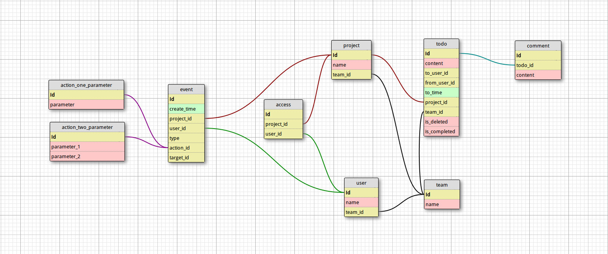

The task for Tower
============

This task is a rebuilding for the display of events and based on ruby on rails.

###configurations

* Ruby version:2.0.0
* Rails version:4.2.0
* database:sqlite 3 (for test)
* test suite:rspec

###The initial model

then add the model ActionWithComments like ActionOneParameter.
ps: In this model ,we ignore some unnecessary relationship.
